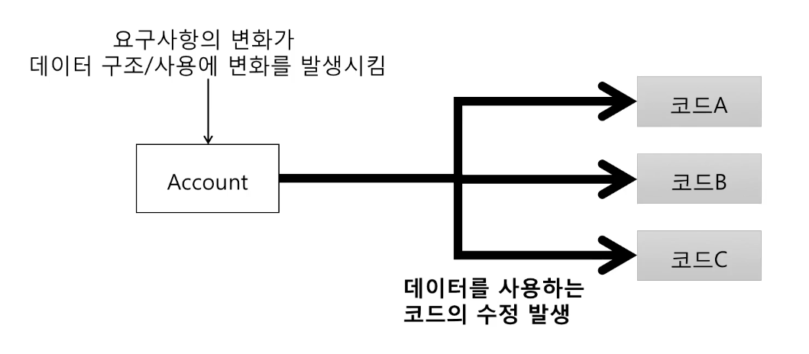
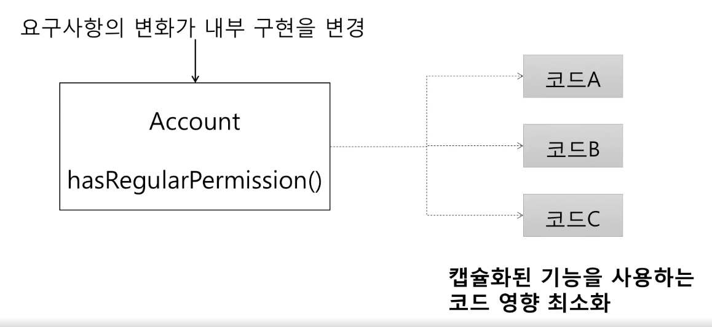

## 캡슐화
- 객체의 속성과 행위를 한 곳에 보관
- 기능의 구현을 외부에 감추는 것
- 실제 구현 내용 일부를 내부에 감추어 은닉
  - 언어적 측면에서 접근 지정자를 두어 은닉의 정도를 기술하여 구현
    - 접근 지정자 : private, protected, public

### 캡슐화하지 않을 경우의 문제점
- 요구사항의 변화에 대처하기가 어려움
  

### 캡슐화의 장점
- 요구사항의 변화에 따른 대처를 용이하게 해주고 캡슐화된 기능을 사용하는 코드의 변경을 최소화함
  
  *캡슐화된 기능을 변경하더라도 해당 기능을 사용하는 클라이언트 코드는 변경하지 않아도 됨*
- 캡슐화를 한다는 것은 기능에 대한 의도를 파악한다는 것과 같음
  - 기능에 대한 이해를 높임

### 캡슐화를 위한 규칙
- Tell, Don't Ask
  - 서버 객체에 데이터를 요구하는 것이 아닌 기능 처리를 위임할 것
    - 서버 객체로부터 데이터를 받아서 클라이언트 객체에서 기능을 처리하는 것이 아닌 서버 객체 내부에서 기능을 처리하도록 할 것
      ```java
      // X. 서버 객체의 데이터를 받은 뒤 기능을 처리
      if(account.getMembership().equals(Membership.REGULAR)) {
        // ...정회원 기능
      }
      
      // O. 서버 객체에게 기능 처리를 요청
      if (account.hasRegularPermission()) {
        // ...정회원 기능
      }
      ```
- Demeter's Law
  - 메서드에서 생성한 객체의 메서드만 호출
  - 파라미터로 받은 객체의 메서드만 호출
  - 필드로 참조하는 객체의 메서드만 호출
  ```java
  // X
  Date date = account.getExpDate();
  date.isAfter(now);
  
  // O
  acc.isValid(now);     // account 의 내부에서 ExpDate 와 now 를 비교하여 처리
  ```