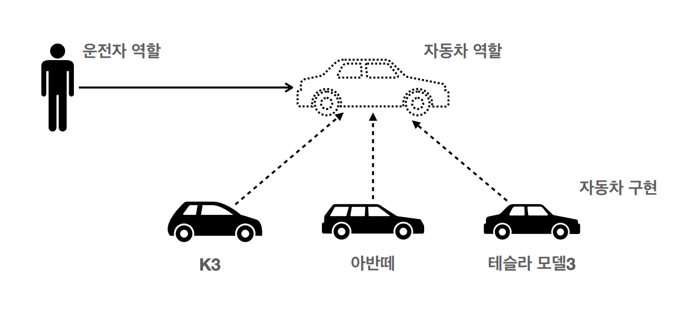

## 다형성
- 프로그램 언어의 각 요소들(상수, 변수, 식, 오브젝트, 함수, 메소드 등)이 다양한 자료형에 속하는 것이 허가되는 성질
    
  *자동차의 모델이 바뀌더라도 운전자는 바뀐 자동차를 운전할 수 있다. 또한, 새로 추가할 모델의 자동차는 자동차의 역할을 수행할 수 있기만 하면 된다.*
- 자바 언어의 다형성
    - 상속 및 오버라이딩을 통해 다형성을 적용
      ```java
      public interface Car {
          void move() {
              System.out.println("move");
          }   
      }
      
      public class K3 implements Car {
          @Override
          void move() {
              System.out.println("K3 move");
          }   
      }
      
      public class Avante implements Car {
          @Override
          void move() {
              System.out.println("Avante move");
          }   
      }
      
      public class User {
          private Car car;
      
          // car 객체의 타입은 K3 일수도, Avante 일수도 있다.
          public User (Car car) {
              this.car = car;
          }
      
          // ...Car 타입의 객체를 통한 코드 구현
      }
      ```