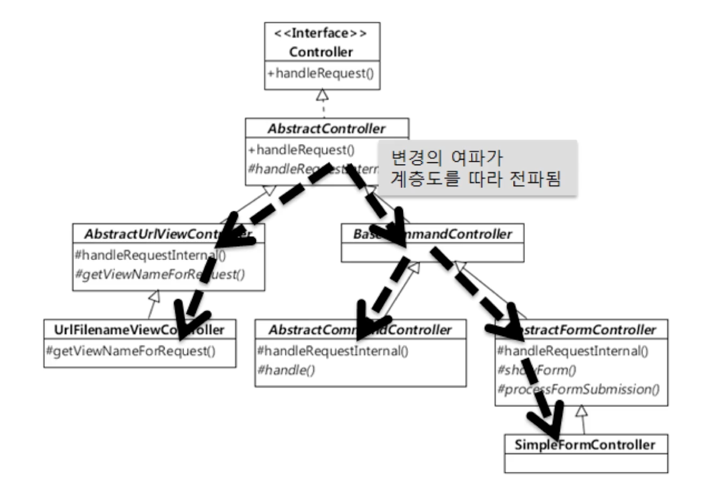

## 상속
- 기존에 정의되어 있는 클래스의 모든 필드와 메소드를 물려받아 기능을 추가하거나 재정의하여 새로운 클래스를 정의

### 상속의 장점
- 기존에 작성된 클래스를 재활용
- 자식 클래스 설계 시 중복되는 멤버를 부모클래스에 작성해 놓으면, 자식 클래스에서는 해당 멤버를 작성하지 않아도 됨

### 상속의 문제점
- 자식 클래스가 늘어날 수록 부모 클래스의 변경이 어려워짐
  

### 상속이 아닌 조립
- Composition
  - 여러 객체를 묶어서 더 복잡한 기능을 제공
  - 상속이 아닌 다른 클래스의 객체를 참조하는 방식으로 필요한 기능을 사용
    ```java
    public class FlowController {
        // 상속이 아닌 참조, 조립을 통해 필요한 기능을 사용
        private Encryptor encryptor = new Encryptor();
    
        public void process() {
            byte[] encryptedData = encryptor.encrypt(data);
        }   
    }
    ```
- 클래스를 상속하기에 앞서 조립으로 풀 수 없는지 검토
  - 기능 재사용을 위해 상속을 쓰는 것이 아닌, 진짜 하위 타입인 경우에만 상속을 사용하는 것을 권장함