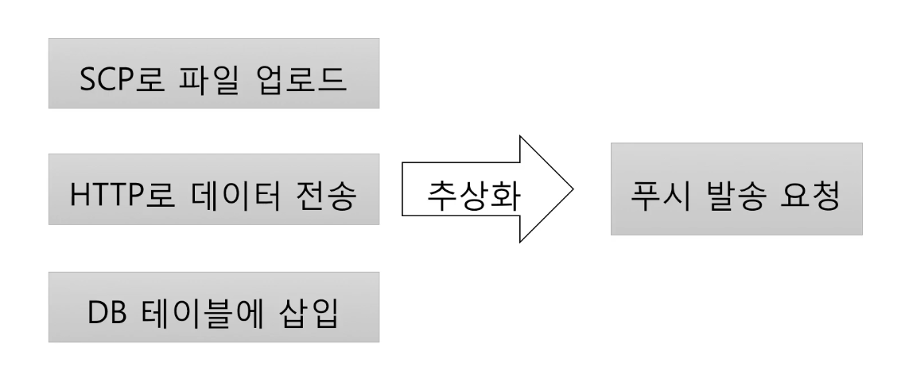
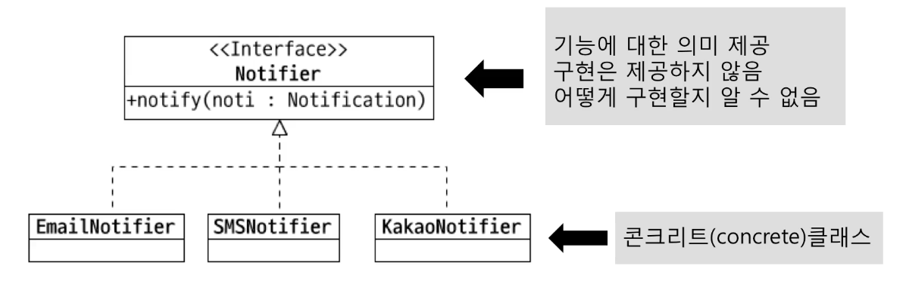

## 추상화
- 데이터나 프로세스 등을 의미가 비슷한 개념이나 의미 있는 표현으로 정의하는 과정
  
  

### 추상화의 장점
- 추상화한 인터페이스 또는 추상클래스를 사용하면 변경에 유연하다.
  - 인터페이스 또는 추상클래스 사용 전
    ```java
    public class NoneAbstractionSnsSender {
        public void cancel(String message) {
            // 취소
        }
    }
    
    public class NoneAbstractionEmailSender {
        public void cancel(String message) {
            // 취소
        }
    }
    
    public class NoneAbstractionSenderService {

        //    private NoneAbstractionSnsSender snsSender;
        private NoneAbstractionEmailSender noneAbstractionEmailSender;
    
        //    public NoneAbstractionSenderService(NoneAbstractionSnsSender noneAbstractionSnsSender) {
        public NoneAbstractionSenderService(NoneAbstractionEmailSender noneAbstractionEmailSender) {
            this.noneAbstractionEmailSender = noneAbstractionEmailSender;
        }

        public void cancel(String message) {

            // 추상화한 인터페이스 또는 추상 클래스가 아닌 콘크리트 클래스를 직접 사용하면 변경 때마다 사용한 모든 코드를 찾아서 수정해야 함!
            //        NoneAbstractionSnsSender.cancel(message);
            noneAbstractionEmailSender.cancel(message);
        }

    }
    ```
  - 인터페이스 적용
    ```java
    public interface Sender {
        void cancel(String message);
    }
    
    public class SnsSender implements Sender{
        @Override
        public void cancel(String message) {
            // 취소
        }
    }
    
    public class EmailSender implements Sender{
        @Override
        public void cancel(String message) {
            // 취소
        }
    }
    
    public class SenderService {
        private Sender sender;

        public SenderService(Sender sender) {
            this.sender = sender;
        }

        public void cancel(String message) {
            // Sender 를 구현한 콘크리트 클래스를 외부에서 변경하여도 코드를 변경하지 않아도 됨. 즉, 변경에 유연하게 대처할 수 있다.
            sender.cancel(message);
        }
    }
    ```
    
### 추상화의 주의점
- 인터페이스 또는 추상 클래스를 통해 추상화를 하면 추상 타입이 증가하여 복잡도가 증가하므로 주의해야 한다. 
때문에 추상 타입이 필요한, 실제 변경 및 확장이 발생할 때 추상화를 시도하는 것이 좋다.